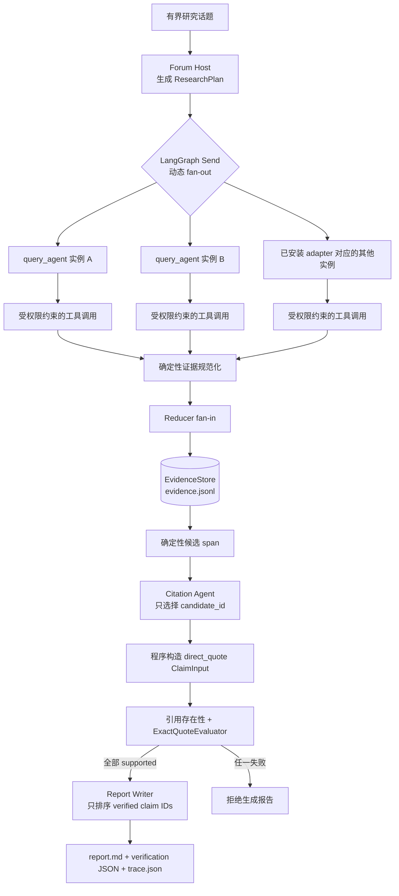

# Personal Opinion Agent

[English](README.md) | **简体中文**

一个基于 LangGraph 的**有界证据研究智能体**。项目以固定角色、真实并行的 LLM 子智能体、受控工具调用、可追溯证据和失败关闭的引用门禁为核心，展示一条从研究规划到报告产出的完整 Agent 工程链路。

> [!IMPORTANT]
> 本项目定位为简历 / 作品集尺度的 Agent 工程项目，不是生产级舆情监控平台。当前主流程处理用户主动提交的单个有界话题，执行一轮研究并生成可检查的本地报告；它尚不包含持续监控、定时采集、完整社交媒体接入、来源可信度判断或总体舆情代表性分析。

## 项目定位

传统搜索或社交媒体信息流通常直接把大量原始内容交给用户。它们可以提供信息，但也容易带来信息过载、重复内容、低质量评论和情绪放大。LLM 能够帮助规划检索与组织材料，但如果让模型直接生成来源、引文和结论，又会引入新的幻觉风险。

本项目研究的是一个更具体的问题：

> 如何让 LLM 负责研究过程中的规划、选择与归纳，同时把工具权限、证据身份、引用文本和报告准入交给确定性程序约束？

项目因此没有追求“尽可能自主”的开放式智能体，而是实现了一个边界明确的研究工作流：

- `Forum Host` 把话题拆分为少量、相互独立的研究任务；
- LangGraph 通过 `Send` 动态创建临时子智能体实例，并行执行这些任务；
- 每个角色只能调用其 Tool Set 允许且运行时实际安装的工具；
- 工具输出经过确定性规范化后才成为证据；
- 模型只能引用程序已经生成的 `evidence_id`；
- 引用智能体只能选择程序生成的候选 span，不能自己编写引文；
- 只有通过支持性验证的 claim 才能进入最终报告；
- 每次运行都保留证据、验证结果和脱敏 trace，便于检查执行过程。

## 当前能力边界

为避免把设计接口误写成已完成能力，仓库中的功能分为四类：

| 类别 | 含义 | 当前内容 |
|---|---|---|
| 已实现并测试 | 存在实际代码和确定性测试 | 固定角色注册表、Skills、Tool Sets、结构化输出、LangGraph 并行研究、证据规范化、引用门禁、报告和 trace |
| 已完成真实集成验证 | 使用真实模型与搜索服务成功运行过 | OpenAI-compatible LLM + Anspire-compatible `web_search` |
| 已定义契约 / 扩展点 | 角色、schema 或工具名已经保留，但生产 adapter 尚未实现 | 数据库检索、多媒体理解、TikHub 社交媒体采集 |
| 历史原型 | 仓库保留的早期实验，不属于当前主项目叙事 | `brief`、`report`、`conversation` 命令 |

当前真实 adapter 只安装 `web_search`，因此目前**实际可执行的研究角色只有 `query_agent`**。`forum_host`、`citation_agent` 和 `report_writer` 会参与完整流程，但它们不是负责外部数据采集的 research worker。

## 核心亮点

### 1. 固定角色，动态实例

系统预先定义七种角色，不允许模型临时发明新角色。`Forum Host` 可以根据话题选择已注册的研究角色，并为同一角色创建多个临时实例。例如，一次研究可以并行启动三个 `query_agent`，分别调查事件特征、商业影响和安全争议。

这种设计区分了两个概念：

- **角色类型**是静态、可审计的能力与权限定义；
- **角色实例**是一次运行中动态创建、任务隔离的执行单元。

### 2. 真实并行的 LLM 子智能体

LangGraph 使用 `Send` 对计划中的任务执行 fan-out。各 worker 节点分别进行模型调用和工具调用，结果通过带 reducer 的共享状态 fan-in，而不是在一个提示词中模拟“多角色讨论”。

并发测试使用 `asyncio.Event` 屏障证明至少两个 worker 模型调用同时进入执行区间，不依赖不稳定的总耗时推断。真实服务 smoke 也记录了三个 `query_agent` 规划调用的重叠时间区间。

### 3. Skills、Tool Sets 与结构化契约

每种角色绑定：

- 固定 `system_prompt`；
- 一组预定义 Skills；
- Tool Set 白名单；
- 输入和输出 schema；
- 单角色最大实例数；
- 共享模型配置。

Skills 是可组合的行为说明，例如 `web_research`、`source_triage`、`citation_audit`；Tool Set 则决定角色可以执行哪些外部动作。两者分别约束“应该怎样思考任务”和“实际上可以做什么”。

所有关键模型输出均通过 Pydantic schema 验证，例如：

- `ResearchPlan`
- `SubagentActionPlan`
- `SubagentResult`
- `CitationSelectionBundle`
- `ReportOutline`

模型输出不是自由文本控制流。非法角色、未知工具、越权工具、重复任务 ID、过量任务、伪造证据 ID 和非法报告 claim 顺序都会被程序拒绝。

### 4. 工具生成证据，而不是模型生成证据

worker 采用两阶段执行：

1. LLM 输出结构化 `SubagentActionPlan`，提出需要调用的工具及参数；
2. 确定性代码检查角色权限、验证参数并执行工具；
3. 工具结果被规范化并分配稳定 `evidence_id`；
4. LLM 只能基于这些结果生成摘要，并只能引用程序提供的 ID。

因此，模型不能通过输出一个看似合理的 ID 把虚构材料写入证据库。

### 5. 引用存在性与 claim 支持性分离

“引用存在”与“证据支持 claim”不是同一件事：

- 引用存在性检查确认 `evidence_id` 确实存在；
- 支持性检查确认 claim 在其声明范围内获得证据支持。

当前确定性 evaluator 是 `ExactQuoteEvaluator`，只支持 `direct_quote`：

- claim 必须引用已有证据；
- claim 全文必须是所引证据中的精确 span；
- evaluator 返回的 supporting span 还会再次与持久化证据核对；
- 任意缺失、格式错误、`unsupported`、`contradicted` 或 `indeterminate` 都会阻止报告产出。

`factual_statement`、`opinion_summary` 和 `analytic_inference` 已进入 claim schema，但在没有配置语义 evaluator 时统一返回 `indeterminate`。这是有意的失败关闭设计，避免把简单字符串匹配包装成通用语义验证。

### 6. 可检查而非“黑盒成功”

一次成功运行会同时保存：

- 原始规范化证据；
- 最终 Markdown 报告；
- claim 和 evaluator 结果；
- 角色实例、模型调用、工具调用、fan-in 和门禁事件。

trace 会移除提示词、隐藏推理、认证头和密钥，并对配置中的 secret 与通用 Bearer token 进行脱敏。它适合审计和定位执行过程，但**不是**包含完整输入输出、模型 checkpoint 与外部响应快照的可重放系统。

## 系统架构



架构存在一条重要边界：

- **LangGraph**负责 `plan_research -> Send fan-out -> run_subagent -> reducer fan-in -> prepare_claims`；
- **ResearchService**负责证据落盘、候选 span 生成、Citation Agent 选择、claim 构造、支持性验证、Report Writer 排序及最终产物写入。

当前并没有把整条后处理流程都包装成 LangGraph 节点。这样做减少了图状态复杂度，也使确定性门禁可以作为普通 Python 服务逻辑单独测试。

## 固定角色

运行时禁止创建注册表之外的新角色。当前七角色如下：

| 角色 ID | 职责 | Skills 示例 | Tool Set | 当前状态 |
|---|---|---|---|---|
| `forum_host` | 分解话题、规划一轮有界研究 | `research_planning`、`gap_analysis` | 无外部工具 | 已实现 |
| `query_agent` | 检索可归因的网页材料 | `web_research`、`source_triage` | `web_search`、`store_evidence` | 已实现，真实 adapter 可执行 |
| `database_researcher` | 检索已有本地证据和历史报告 | `evidence_retrieval`、`prior_report_review` | `search_evidence`、`read_evidence` | 仅定义契约 |
| `multimedia_researcher` | 从图像或视频中提取有界观察 | `multimedia_inspection`、`source_triage` | `inspect_media`、`store_evidence` | 仅定义契约 |
| `citation_agent` | 从候选 source span 中选择引用 | `claim_atomization`、`citation_audit` | 引用检查相关 Tool Set | 已实现 |
| `report_writer` | 对已验证 claim 排序，不新增内容 | `evidence_synthesis`、`report_writing` | 报告相关 Tool Set | 已实现 |
| `tikhub_researcher` | 通过 TikHub 采集有界社媒记录 | `social_media_research`、`source_triage` | `tikhub_search`、`store_evidence` | 仅定义契约 |

角色注册表中的 Tool Set 表达设计权限；角色能否在本次运行中执行，还取决于 `ToolRegistry` 是否安装了相应 adapter。有效能力是二者的交集：

```text
effective_tools(role) = role.tool_ids ∩ installed_tool_ids
```

真实工厂当前只注册 `web_search`，所以 Forum Host 的可选 research role 会被收缩为 `query_agent`。即使模型输出其他已注册角色，能力校验也会在 fan-out 前拒绝该计划。

## 核心数据流

### 1. 研究规划

用户提供非空 `topic`。`Forum Host` 接收固定角色说明和可执行角色列表，返回 `ResearchPlan`。程序会：

- 强制把 plan 中的 topic 修正为用户原始 topic；
- 检查 `task_id` 唯一性；
- 检查全局并行上限；
- 检查各角色的 `max_instances`；
- 检查所选角色是否具备已安装工具。

当前流程只执行**一轮 bounded research**，不会在发现证据缺口后无限自循环。

### 2. 并行 worker

每个 `ResearchTask` 通过 `Send` 形成独立 `run_subagent` 输入。worker 首先让模型生成最多三个结构化工具调用，然后逐个执行该任务内部的工具调用。

不同任务实例可以并发执行；同一 worker 内的多个工具调用当前是顺序执行的。共享状态中的 `subagent_results`、`evidence_records`、`trace_events` 和 `errors` 使用 reducer 合并。

### 3. 证据规范化

搜索结果不会原样成为内部任意对象。规范化层会：

- 每次工具调用最多接收三个结果；
- 每条持久化内容最多保留 4000 个字符；
- 保存 source type、provider、URL、标题、发布时间和内容；
- 把 provider metadata 放入独立命名空间，防止覆盖可信 provenance 字段；
- 使用规范化身份和原始完整内容的 SHA-256 共同生成稳定 ID；
- 记录任务、角色、query、provider request ID 和截断信息。

`EvidenceStore` 使用 append-only JSONL，以 `evidence_id` 去重。它适合本地、可检查的作品集项目，但不是并发写入和大规模检索场景下的生产数据库。

### 4. 候选 span 与 Citation Agent

`ResearchService` 从持久化证据中确定性生成有长度限制的候选文本，并为候选分配 `candidate_id`。Citation Agent 接收 topic 与候选列表，只能输出一个：

```json
{
  "selections": [
    {
      "claim_id": "claim-1",
      "candidate_id": "ev-example:0"
    }
  ]
}
```

它不能输出 quote 文本，也不能指定新的 `evidence_id`。程序根据 `candidate_id` 查回原候选，并构造：

- `claim_type = direct_quote`
- 候选原文作为 `ClaimInput.text`
- 候选所属证据的 `evidence_id`
- 来源平台、单条样本和可用时间信息组成的 scope

如果候选 ID 非法或 claim 未通过门禁，服务最多请求一次修复；第二次仍失败则拒绝本次报告。

### 5. 支持性门禁

Claim Contract 支持以下类型：

| `claim_type` | 当前 evaluator 行为 |
|---|---|
| `direct_quote` | 检查完整 claim 是否为所引证据中的精确 span |
| `factual_statement` | `indeterminate` |
| `opinion_summary` | `indeterminate` |
| `analytic_inference` | `indeterminate` |

Claim 可以声明 `platform`、`time_window` 和 `sample`。当前 evaluator 会保存并核对 scope 一致性，但不会判断样本是否足以代表平台或社会总体。

门禁通过意味着：

> 在 claim 声明的范围内，其完整直接引文能在指定的持久化证据中找到。

它**不意味着**：

- 来源陈述一定真实；
- 来源具有高可信度；
- 多个网页结果彼此独立；
- 收集样本具有统计代表性；
- 支持更宽范围的因果或舆情结论；
- 模型摘要中的其他语义判断已经被验证。

### 6. 报告生成

Report Writer 接收的不是原始证据，也不是自由写作任务，而是已经通过门禁的 claim 列表。它只能输出 `ordered_claim_ids`，不能写标题、正文或新增 claim。

程序随后再次执行支持性验证，并使用确定性模板渲染 Markdown。topic、claim、来源和 ID 会进行 Markdown 安全转义，降低内容注入破坏报告结构的风险。报告和 verification sidecar 通过临时文件替换写入。

## 快速开始

### 环境要求

- Python 3.11 或更高版本
- PowerShell 示例命令；其他 shell 可使用等价语法

安装项目及测试依赖：

```powershell
python -m pip install -e ".[test]"
```

运行完整测试：

```powershell
python -m pytest tests -q
```

### 无凭据运行

`fake` adapter 使用确定性本地 fixture，可以验证从规划、并行 worker、证据生成、引用门禁到报告输出的完整链路：

```powershell
python -m opinion_agent research `
  --topic "Sample bounded event" `
  --adapter fake `
  --output-dir output\research
```

命令成功后会输出 run ID、状态及产物路径。示例报告可见 [`examples/sample_research_report.md`](examples/sample_research_report.md)。

### 真实服务运行

复制环境变量模板：

```powershell
Copy-Item .env.example .env
```

在本地填写必要配置后运行：

```powershell
python -m opinion_agent research `
  --topic "A bounded social event" `
  --adapter real `
  --output-dir output\research
```

也可以通过 `--env-file` 指定其他配置文件：

```powershell
python -m opinion_agent research `
  --topic "A bounded social event" `
  --adapter real `
  --env-file .env `
  --output-dir output\research
```

请勿提交 `.env`、API key、认证头或真实服务的敏感请求内容。

## 环境变量

| 变量 | 必填 | 说明 |
|---|---:|---|
| `LLM_API_KEY` | 真实运行必填 | OpenAI-compatible 模型服务密钥 |
| `LLM_BASE_URL` | 真实运行必填 | OpenAI-compatible 服务地址 |
| `LLM_MODEL_NAME` | 真实运行必填 | 共享模型名称 |
| `SEARCH_PROVIDER` | 真实运行必填 | 当前必须为 `anspire` |
| `SEARCH_API_KEY` | 真实运行必填 | 搜索服务密钥 |
| `SEARCH_BASE_URL` | 真实运行必填 | Anspire-compatible 搜索端点 |
| `TIKHUB_API_KEY` | 可选 | TikHub 预留配置；当前真实工厂尚未安装 TikHub 工具 |
| `TIKHUB_BASE_URL` | 可选 | 与 `TIKHUB_API_KEY` 必须同时提供 |
| `MAX_PARALLEL_SUBAGENTS` | 可选 | 全局并行任务上限，默认 `4` |
| `LLM_REQUEST_TIMEOUT` | 可选 | 模型请求超时秒数，默认 `180` |
| `SEARCH_TIMEOUT` | 可选 | 搜索请求超时秒数，默认 `30` |

真实运行要求 LLM 与搜索两组配置完整。TikHub 配置即使存在，也不会自动使 `tikhub_researcher` 可执行；还需要实现并注册对应 adapter。

## 运行产物

每次研究使用独立且不可覆盖的 run 目录：

```text
output/research/run-<id>/
  evidence.jsonl
  report.md
  report_verification.json
  trace.json
```

| 文件 | 内容 |
|---|---|
| `evidence.jsonl` | 工具输出规范化后的 append-only 证据记录 |
| `report.md` | 仅包含已通过门禁 claim 的确定性 Markdown 报告 |
| `report_verification.json` | Claim Contract、scope、verdict、supporting spans 和 evaluator 版本 |
| `trace.json` | 脱敏后的角色、模型、工具、fan-out/fan-in、验证及运行状态事件 |

运行状态包括：

- `completed`：证据、claim、门禁和报告全部成功；
- `rejected`：研究产生错误、没有证据或 claim 未通过准入；
- `failed`：发生未能归类为正常拒绝的异常。

拒绝或失败的运行仍会尽量保留 `evidence.jsonl` 与 `trace.json`，但不会把不合格内容包装成成功报告。

## 仓库结构

```text
opinion_agent/
  agents/       固定角色、Skills 与结构化数据契约
  graph/        LangGraph 状态图、Send fan-out 与 reducer
  tools/        ToolRegistry、权限检查与搜索 adapter
  evidence/     证据规范化、稳定 ID 与 JSONL 存储
  citations/    Claim Contract、引用检查与支持性 evaluator
  research/     fake/real 工厂及端到端 ResearchService
  reports/      失败关闭的报告与 verification sidecar
  tracing/      trace 脱敏和原子写入
  llm/          OpenAI-compatible structured model adapter
tests/          单元、边界、并发和端到端测试
examples/       确定性输入与示例报告
docs/
  verification/ 真实服务 smoke 验证记录
  superpowers/   设计规格与实施计划
```

建议按以下顺序阅读主流程：

1. [`opinion_agent/agents/registry.py`](opinion_agent/agents/registry.py)：七角色定义；
2. [`opinion_agent/agents/models.py`](opinion_agent/agents/models.py)：结构化输出契约；
3. [`opinion_agent/graph/research.py`](opinion_agent/graph/research.py)：规划、`Send` 并行和 worker；
4. [`opinion_agent/evidence/normalizer.py`](opinion_agent/evidence/normalizer.py)：证据身份与 provenance；
5. [`opinion_agent/research/service.py`](opinion_agent/research/service.py)：后处理与完整编排；
6. [`opinion_agent/citations/verifier.py`](opinion_agent/citations/verifier.py)：失败关闭门禁；
7. [`opinion_agent/reports/generator.py`](opinion_agent/reports/generator.py)：确定性报告渲染；
8. [`opinion_agent/tracing/run_trace.py`](opinion_agent/tracing/run_trace.py)：trace 脱敏。

## 测试与真实验证

当前完整测试结果为：

```text
99 passed
```

测试覆盖的关键性质包括：

- 角色注册表不可随意扩展，未知角色被拒绝；
- Tool Set 权限在 handler 执行前检查；
- Pydantic 对模型结构化输出进行边界验证；
- 研究计划受全局和单角色实例上限约束；
- `Send` worker 真实并发并通过 `asyncio.Event` 屏障证明重叠；
- 模型生成的未知 `evidence_id` 被拒绝；
- 证据 ID 稳定，并考虑被截断内容的完整原文哈希；
- provider metadata 不能覆盖可信 provenance；
- 缺失引用、非法 claim、unsupported 和 indeterminate 均失败关闭；
- Report Writer 不能增加、删除或重复 verified claim；
- Markdown 注入内容不会改写报告结构；
- trace 不包含 prompt、hidden reasoning、API key 或 Bearer token；
- 重复 run ID 和并发目录竞争不会覆盖已有产物。

真实服务集成验证使用一个 OpenAI-compatible 模型和一个 Anspire-compatible 搜索端点完成，结果为：

- 运行状态：`completed`
- 并行任务：3 个 `query_agent` 实例
- 三个真实 `SubagentActionPlan` 模型调用时间区间相互重叠
- 持久化证据：23 条
- 最终 claim：1 条
- 支持性结果：1 条 `supported`
- 敏感 trace 标记检查：未发现

完整记录见 [`docs/verification/2026-06-07-real-provider-smoke.md`](docs/verification/2026-06-07-real-provider-smoke.md)。真实运行目录未提交到 Git，仓库只保留不含凭据的验证摘要和确定性示例。

## 关键设计取舍

### 为什么使用固定角色而不是让模型创建角色？

固定角色使权限、schema、实例上限和测试边界可枚举。模型仍然可以动态决定启用哪些角色、创建多少实例，但不能扩大系统能力边界。这比完全开放的角色生成更适合需要可审计性的研究流程。

### 为什么让模型选择工具，却由代码执行工具？

模型适合根据语义决定“需要搜索什么”，但不适合成为权限和数据真实性的最终裁判。工具调用分层后，模型负责意图，代码负责授权、参数校验、执行和错误处理。

### 为什么只验证 direct quote？

精确引文验证范围窄，但结果可重复、易解释。事实陈述、观点归纳和分析推断需要处理语义蕴含、证据冲突、来源可靠性和 scope 对齐；在没有可靠 evaluator 前返回 `indeterminate`，比使用一个无法证明能力的通用 LLM 打分器更严谨。

### 为什么 Citation Agent 只选择 candidate ID？

早期思路让模型直接输出引文，会出现复制错误、轻微改写或虚构 span。当前方案先由代码从证据生成候选，再让模型做语义选择，最后由代码恢复原文，从结构上避免 Citation Agent 改写引用。

### 为什么 Report Writer 只负责排序？

如果报告模型可以自由写作，它可能在已验证 claim 之间增加过渡性事实、扩大 scope 或生成未经验证的结论。把其输出压缩为 claim ID 排序后，最终报告内容完全来自通过门禁的数据。

### 为什么使用 JSONL 而不是数据库？

本项目的数据量小，核心目标是展示 evidence provenance 和 Agent 编排。JSONL 易于检查、测试和版本外审计，不引入与当前目标无关的基础设施。数据库 adapter 已作为后续扩展点保留。

### 为什么图只覆盖研究阶段？

并行 fan-out/fan-in 是 LangGraph 最有价值的部分；引用验证与文件写入则更适合确定性服务代码。当前边界降低了状态图复杂度，也让各门禁函数可以直接进行单元测试。将全流程图化只有在需要 checkpoint、人工审批或恢复执行时才更有价值。

## 已知局限

- 当前不是持续运行的舆情监控系统，没有 scheduler、增量抓取和告警。
- 真实 adapter 只有网页搜索，数据库、多媒体和 TikHub 尚未接入生产工具。
- 当前只执行一轮研究，不会根据验证结果自动发起第二轮证据补全。
- 每次只选择一个 quote candidate，报告表达能力有意保持很窄。
- `ExactQuoteEvaluator` 不具备语义蕴含、矛盾检测或事实核验能力。
- 搜索结果存在不等于来源真实、可信、独立或具有代表性。
- 没有去重近似转载、来源评级、立场聚类、趋势检测和统计抽样。
- worker 内多个工具调用顺序执行，尚未实现任务内部并行。
- JSONL store 不面向多进程并发写入、大规模索引或向量检索。
- trace 是可检查的事件摘要，不保存足以完整重放运行的全部状态。
- 尚无 Web UI、鉴权、配额、成本预算、可观测平台或生产部署方案。
- 所有角色当前共享一个模型 profile，角色差异来自 prompt、Skills、Tool Sets 和 schema。

## 后续方向

### 工程扩展

- 实现 `database_researcher` 的结构化检索 adapter；
- 接入多模态模型，为 `multimedia_researcher` 保存时间戳或区域级 provenance；
- 注册 TikHub 工具并实现平台字段规范化；
- 增加 checkpoint、人工审核节点和失败恢复；
- 为外部调用增加重试、速率限制、缓存、成本统计和熔断；
- 将 JSONL 迁移为支持全文与向量检索的证据存储；
- 增加近重复来源检测和跨来源聚合；
- 在保持门禁的前提下支持多 claim 报告。

### 研究问题

- 如何验证 `factual_statement` 的语义支持，而不把 evaluator 变成另一个不可解释的幻觉源？
- 如何区分多个搜索结果是独立证据，还是同一信息源的转载链？
- 如何把来源可信度、时效性和利益相关性纳入 claim-level 判断？
- 如何显式建模不同平台、时间窗口和样本选择造成的 scope 偏差？
- 如何评估一个 Agent 报告的证据覆盖率，而不仅是已有 claim 的正确率？
- 如何在检索成本、并行度、证据多样性和报告质量之间进行可测量优化？

## 进一步阅读

- [英文 README](README.md)
- [项目面试与技术详解](docs/PROJECT_INTERVIEW_GUIDE.zh-CN.md)
- [当前研究智能体范围设计](docs/superpowers/specs/2026-06-06-evidence-research-agent-resume-scope-design.md)
- [Claim-Evidence 支持门禁设计](docs/superpowers/specs/2026-06-06-claim-evidence-support-gate-design.md)
- [真实服务 smoke 验证](docs/verification/2026-06-07-real-provider-smoke.md)

## License

仓库当前未声明开源许可证。除非后续添加明确的 LICENSE 文件，否则代码的使用、复制和分发不应被视为已经获得通用开源授权。
